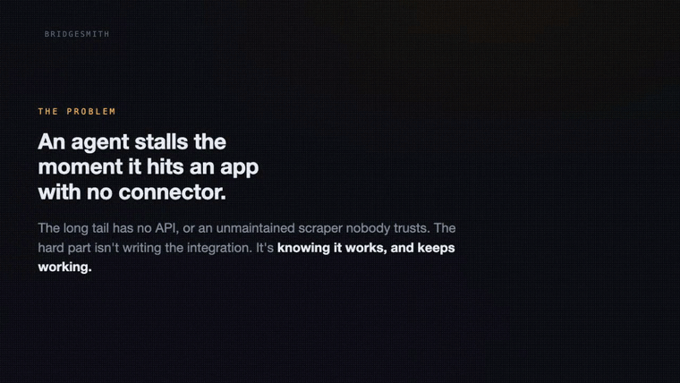

<div align="center">

# Bridgesmith

**An agent that builds its own integrations and refuses to use the ones it can't prove work.** Point it at an app with no connector; it reverse-engineers the API, generates an MCP server + REST connector, and only mounts what passes certification against held-out evidence.

[](https://github.com/lgoyal6/bridgesmith/actions/workflows/ci.yml)
[](package.json)
[](tsconfig.json)
[](test)
[](LICENSE)

<a href="https://www.youtube.com/watch?v=HA4aw3cb8B4"></a>

### ▶ [Watch the 2-minute demo](https://www.youtube.com/watch?v=HA4aw3cb8B4)

[What it is](#what-it-is) · [How it works](#how-it-works) · [Why it matters](#why-it-matters) · [Alignment](#how-it-aligns-with-the-hosts) · [Try it](#try-it) · [Reliability](#reliability-measured)

</div>

> Most connector tools ask, "how do I call this API?" Bridgesmith asks, "how do I *know* this connector works, and how do I know the moment it stops?"



<sub>Silent capture from real runs: the terminal forges a Chess.com connector, certifies it against an independent holdout (40/40 mutation tests caught), and mints a signed certificate. Every log line and number is from an actual run; the fixtures are public, no-auth data.</sub>

## What it is

Bridgesmith is a **connector foundry** — a runtime that lets an AI agent extend itself. When an agent needs an app it has no integration for, Bridgesmith captures that app's own traffic, derives a spec, generates a connector exposing **both an MCP server and a keyed REST API** from one adapter core, and **certifies it against independent held-out evidence** before it can be used. Certified connectors get a signed birth certificate and enter a registry; drift at runtime triggers automatic re-certification and hot-swap, or demotion.

**The problem it solves.** Agents stall the moment they hit an app with no connector, and the connectors that exist for the long tail are unmaintained scrapers nobody trusts. The expensive part was never *writing* the integration — it's **knowing it works, and knowing the instant it breaks.** Bridgesmith makes the integration disposable and the *certificate* the durable artifact: an agent can manufacture a tool mid-task and have machine-checkable proof it is safe to call.

**Why it's important.** Every autonomous agent is one unverified tool call away from a silent failure — a connector that returns a schema-valid empty list, a field that quietly changed type, an endpoint that moved. Bridgesmith turns those silent failures into loud, typed, attributed ones, and never serves data it cannot certify.

## How it works

The core idea: **certification is the gate between *generated* and *mounted*.** A connector is derived from one capture and graded against a *different, independent* capture — never its own homework — plus a mutation suite that proves the gate rejects wrong data, not just confirms what it already saw.

```
 capture A ─┐                                   ┌── MCP server ──┐
            ├─ derive spec (from A only) ───────┤    adapter     ├── certified ops only
 capture B ─┘         │                         └── REST API ────┘
 (holdout)            ▼
              ┌───────────────────────────────────────────────┐
              │  CERTIFY                                        │
              │   1. holdout replay   (validate B vs the spec)  │
              │   2. mutation suite   (corrupt B → must reject) │
              │   3. live canary      (read-only, optional)     │
              │   repair loop (bounded): re-infer over A∪B      │
              └───────────────────────────────────────────────┘
                     │ all green?
             ┌───────┴────────┐
        yes  ▼                ▼  no
   sign birth cert       REFUSE — name the
   → registry → mount    failing / uncovered ops

 runtime:  every response schema-validated → drift trips the breaker →
           re-capture → re-certify → hot-swap   ·OR·   DEMOTE and refuse
```

**Access ladder (pluggable drivers, uniform certification).** Every rung produces the same `Exchange[]`, so everything downstream is identical:

1. **official-api** — a documented public API.
2. **derived-api** — reverse-engineer the app's own XHR/JSON traffic into a spec (`mitmproxy`-style capture → inference).
3. **browser-bridge** — UI automation for apps with no reachable XHR *(documented; not in v0)*.
4. **local-store** — desktop apps whose data lives in a local SQLite file (iMessage, Notes, Safari), read-only via the `sqlite3` CLI.

**The technical spine** (file-level, so every claim is checkable):

| Stage | What it does | Where |
| --- | --- | --- |
| Capture | HAR + live fetch; **secrets redacted at ingest** so fixtures never hold credentials | `src/capture/` |
| Derive | trie path-templating (varying id vs distinct resource by cardinality); schema inference with an **evidence floor** (a field is `required` only with enough samples) | `src/spec/` |
| Certify | independent-holdout replay + mutation suite + bounded repair loop | `src/certify/` |
| Sign | ed25519 birth certificate over canonical JSON; on-disk registry | `src/registry/` |
| Serve | one spec-driven adapter → MCP + REST surfaces, exposing certified ops only | `src/codegen/`, `src/surfaces/` |
| Guard | runtime schema gate (shared validator), circuit breaker, **false-green rate**, self-heal | `src/runtime/` |

The LLM plans (which tier, when to re-capture, when to refuse); everything that produces a guarantee is deterministic code, so there is no generated-code failure surface to trust.

## Why it matters

A working connector is a snapshot; a *certified* one is a claim you can re-check. Bridgesmith is built so three things are structurally impossible: mounting an uncertified tool, mounting an operation with no held-out evidence, and returning schema-invalid data. It does **not** claim "never fails" — it claims **no failure is silent**. Every outcome is a typed, counted event (`ok | schema-violation | http-error | network-error | refused | anomaly`), and drift is met with re-certification or refusal, never a quiet wrong answer.

## How it aligns with the hosts

Bridgesmith uses **no sponsor SDK** — the hackathon named none, and its own thesis is the point. But it is aimed squarely at what the host and judges are building:

- **Lemma (host) — silent failures in production agents.** Bridgesmith's whole design is to convert silent tool failures into loud, attributed, traced ones, and its false-green rate measures exactly the "certified-but-actually-wrong" gap Lemma detects. It's the same worldview implemented at mount time and runtime. **It could feed Lemma** a certificate + drift signal per connector, so their traces start with a ground-truth spec to diff against.
- **Arga Labs (judge) — sandboxes that rehearse agents before they go live.** "Certify against held-out evidence before mounting" is rehearse-before-prod as a runtime primitive; the mutation suite is an adversarial test harness. **It could complement Arga** as the live-side counterpart to their pre-live twins: re-certify against reality when the app drifts.
- **Userlens (judge) — the integration long tail.** Manufacturing certified connectors for apps with no API *is* the long-tail problem Userlens fields weekly. **It could help Userlens** turn "can you integrate with X?" into a forge-and-certify step instead of a maintenance liability.

## External apps

The demo agent spans four external apps — two via connectors Bridgesmith builds and certifies itself, two established:

1. **Devpost** — connector manufactured + certified live from its public API (no prior connector used).
2. **Chess.com** — second connector manufactured + certified live (public API).
3. **Notion** — established; the agent writes certified-connector results into it.
4. **Slack** — established; the agent posts a run summary.

Plus **iMessage** as the local-store tier — an app with no network API at all, given one read-only.

## Try it

```bash
pnpm install && pnpm build
pnpm test                              # 154 tests, all green

# Forge + certify a connector from a public API (two independent capture slices):
node dist/cli/index.js forge devpost \
  --derive  "https://devpost.com/api/hackathons?page=1,https://devpost.com/api/hackathons?page=2,https://devpost.com/api/hackathons?page=3,https://devpost.com/api/hackathons?page=4,https://devpost.com/api/hackathons?page=5,https://devpost.com/api/hackathons?page=6" \
  --holdout "https://devpost.com/api/hackathons?page=7,https://devpost.com/api/hackathons?page=8,https://devpost.com/api/hackathons?page=9,https://devpost.com/api/hackathons?page=10" \
  --host devpost.com --min-required 4

node dist/cli/index.js list                                   # registry + certificate validity
node dist/cli/index.js call devpost get_api_hackathons --param page=12
node dist/cli/index.js serve devpost                          # REST facade: GET /manifest, POST /op/:opId
```

Reproduce the evidence:

```bash
pnpm tsx scripts/eval.ts                   # the reliability table below, from live public APIs
pnpm tsx scripts/selfheal-proof.ts         # drift → hot-swap → demote timeline
pnpm tsx scripts/replay-proof.ts           # certify against a live public API, then reproduce it
                                           #   offline with global fetch disabled
pnpm tsx scripts/drift-proof.ts            # one schema drift and one semantic false green:
                                           #   detected, attributed, bundled, replayed offline
pnpm tsx scripts/write-workflow-proof.ts   # a certified multi-step WRITE workflow, replayed
                                           #   fixtures only — nothing real is mutated
```

How the trust chain fits together: [`docs/TRUST-CHAIN.md`](docs/TRUST-CHAIN.md).
What was borrowed from Sigstore/TUF, Schemathesis, Pact, OpenTelemetry, Cedar/OPA
and WASI, and what is not: [`docs/PRIOR-ART.md`](docs/PRIOR-ART.md).
What key lifecycle does **not** do: [`docs/KEY-LIFECYCLE-GAP.md`](docs/KEY-LIFECYCLE-GAP.md).

## Reliability, measured

From `scripts/eval.ts` against live public APIs (no auth, no secrets). Derive and holdout are **independent** captures; the probe uses inputs never seen during either.

The two false-green rates are reported **separately** and never summed. A connector that declares no semantic invariants has no semantic axis to report, which is a statement about coverage, not a clean bill of health.

| Connector | Certified | Holdout | Mutants caught | Unseen-input probe | Invariants held | Schema false-green | Semantic false-green | Silent failures |
| --- | --- | --- | --- | --- | --- | --- | --- | --- |
| chess.com | 1/1 | 8 | 40/40 | 4/4 | 1/1 | 0% (0/1) | 0% (0/1) | **0** |
| devpost | 1/1 | 4 | 40/40 | 5/5 | 1/1 | 0% (0/1) | 0% (0/1) | **0** |

**These numbers changed, and the reason is worth stating.** An earlier run of this table showed chess.com at 3/4 on the unseen-input probe and a 100% schema false-green rate, and devpost refusing to certify at all. Both were defects in schema inference, not in the services:

- A capture of ten grandmasters all carry `title: "GM"`, and the inference asserted `enum: ["GM"]` from it — a closed vocabulary manufactured out of a single observed value. The first International Master then tripped the runtime gate. Inference now requires at least two values, each recurring, before it will claim a vocabulary is closed (`src/spec/infer.ts`).
- Array element sampling took the first 50 elements in order. Since the repair loop re-infers over `[...derive, ...holdout]`, any derive capture whose arrays alone filled that budget truncated the holdout away entirely — so repair re-derived an identical schema, twice, and the operation was refused after two iterations that could never have succeeded. Sampling is now round-robin across response bodies.

The runtime gate caught the false green **loudly** as a schema violation and never returned wrong data, which is the property that held throughout. But a gate that has to catch a failure its own inference created is not a good outcome, and the fix belonged in the inference. Regression tests: `test/infer.test.ts` I1-I5. Full discussion in [`docs/RELIABILITY-BRIEF.md`](docs/RELIABILITY-BRIEF.md).

## What works / what does not

| Area | Status |
| --- | --- |
| Derived-api + local-store tiers, end to end | **Works.** verified on live Chess.com/Devpost + SQLite. |
| Independent-holdout certification + mutation suite | **Works.** 40/40 mutants caught on both live targets. |
| Signed certificates anchored to the registry's own key, registry, MCP + REST surfaces | **Works.** |
| Self-heal (drift → re-certify → hot-swap, or demote) | **Works.** `scripts/selfheal-proof.ts`. |
| Declared semantic invariants (totals, cross-endpoint id agreement, vocabulary, ordering, pagination union, unit drift) | **Works.** six named classes; `test/semantic.test.ts`. |
| Version compatibility classification + approval-gated promotion | **Works.** `scripts/`/`src/registry/compat.ts`. |
| Signed replay bundles, reproduced offline with the network disabled | **Works.** `scripts/replay-proof.ts`, `scripts/drift-proof.ts`. |
| Certified capability manifest enforced at egress (origins, methods, paths, secrets, files, writes, redirects) | **Works.** deny-by-default, read-only by default. |
| Certified multi-step workflows: ordering, cursor advance, per-step auth, idempotency, compensation | **Works.** `scripts/write-workflow-proof.ts`. |
| Browser-bridge tier (pure-UI apps) | **Not built.** documented T3 rung. |
| **General** semantic correctness | **Out of scope, by design.** only DECLARED invariants are certified; a connector declaring none reports `semanticVerdict: "not-declared"`, never a pass. |
| Write/mutating operations against a live third party | **Never.** write workflows are certified against replayed fixtures only. |
| Key rotation, revocation, effective-time verification | **Not implemented.** see [`docs/KEY-LIFECYCLE-GAP.md`](docs/KEY-LIFECYCLE-GAP.md). |
| Code sandboxing (WASI or equivalent) | **Not applicable today.** no generated code executes; see [`docs/PRIOR-ART.md`](docs/PRIOR-ART.md). |

## Honest scope

Reverse-engineering a private API can violate an app's ToS; Bridgesmith is run only against **public, no-auth data** or **your own session reading your own data**, never a scraped app-wide secret or a bypassed protection. Captured traffic is redacted at ingest. "Certified" means *consistent with independent held-out evidence and robust to schema mutation* — not *provably correct*.

## Demo

Video (≤2 min): **https://www.youtube.com/watch?v=HA4aw3cb8B4**

MIT licensed.
